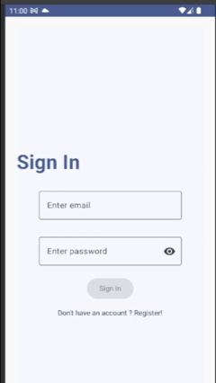
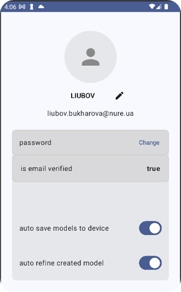
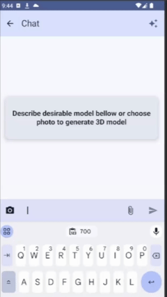
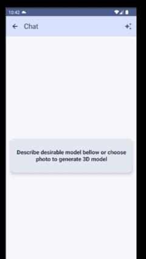
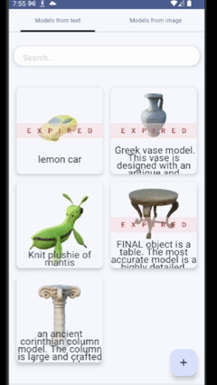
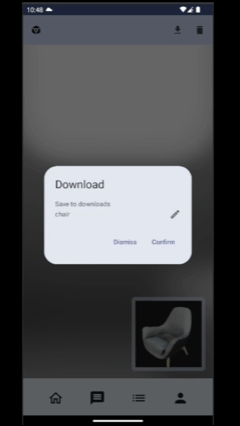
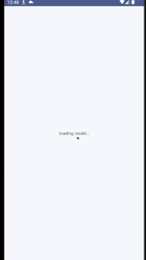

# AI-Powered 3D Model Generation — Android App

> Generate, refine, and visualize three-dimensional models from text descriptions and photos using AI — directly on your Android device.

[PASTE IMAGE] <!-- App banner or logo (recommended: 1280×640 px PNG) -->

---

## Table of Contents

- [Overview](#overview)
- [Screenshots](#screenshots)
- [Tech Stack](#tech-stack)
- [Architecture](#architecture)
- [AI Description Flow](#ai-model-description-flow)
- [Core Features](#core-features)
- [Setup & Configuration](#setup--configuration)
- [Supported Formats](#supported-formats)
- [Testing](#testing)

---

## Overview

This Android application lets users create accurate 3D models through a guided AI conversation or by uploading a photo. Models can then be explored in an interactive 3D scene or placed into the real world via Augmented Reality.

**Key capabilities:**
- AI-assisted prompt refinement via GPT before generation
- Text-to-3D and image/photo-to-3D via Meshy AI
- Interactive 3D viewer (Filament) and AR placement (ARCore)
- Model library with category filtering, history, and deletion
- Cloud-synced user data via Firebase + Firestore

---

## Screenshots

### Sign In


### User Cabinet


### Text-to-3D Generation via AI Chat


### Image-to-3D — Photo Input


### Model Library


### 3D Viewer


### AR Mode


---

## Tech Stack

| Tool / Service | Purpose |
|---|---|
| **Meshy AI** | 3D model generation API — text-to-3D and image-to-3D |
| **OpenAI GPT API** | Conversational assistant for refining model prompts |
| **Firebase Authentication** | User sign-in and session management |
| **Firestore** | NoSQL cloud database for user data and model metadata |
| **Amazon S3** | Object storage for generated 3D model assets |
| **Retrofit** | HTTP client — maps REST endpoints to Kotlin interfaces |
| **Hilt** | Dependency injection |
| **WorkManager** | Background task scheduling for long-running generation jobs |
| **Filament** | Real-time 3D rendering engine |
| **ARCore** | Augmented Reality placement and tracking |

---

## Architecture

The app follows **Clean Architecture** with three layers: UI → Domain → Data.

```
UI Layer        ViewModel  ←→  UseCase
                                  ↕
Domain Layer             Repository (interface)
                                  ↕
Data Layer       RepositoryImpl  →  Remote API / Firestore / S3
```

**Example flow — text-to-3D:**
```
ChatScreen → ChatViewModel → SendMessageUseCase → GPT RepositoryImpl → OpenAI API
                                    ↓
                          GenerateModelFromTextUseCase
                                    ↓
                     WorkManagerMeshyRepo → GetTextModelIdWorker
                                              → GetTextModelWorker
                                              → SaveModelWorker
```

Key component roles:
- **ViewModel** — holds and exposes UI state; survives configuration changes
- **UseCase** — single-responsibility business logic unit
- **Repository** — abstracts data sources behind a stable interface
- **Workers** — run generation polling in the background via WorkManager

---

## AI Model Description Flow

Before submitting a prompt to Meshy, the user refines it through a structured GPT conversation.

### Conversation Rules

| Trigger | Behavior |
|---|---|
| Regular user message | GPT asks targeted follow-up questions (color, size, shape, material, style, quality) |
| Message contains `NEXT` | GPT continues asking refinement questions |
| Message contains `END` | GPT immediately outputs the final description |

Final response always begins with: **`FINAL object is …`**

### Style Options

`fantasy` · `cartoon` · `sci-fi` · `futurist` · `realistic` · `ancient` · `elegant` · `ultra realistic` · `trending on artstation` · `masterpiece` · `cinema 4d` · `unreal engine` · `octane render`

### Quality Options

`highly detailed` · `high resolution` · `highest quality` · `best quality` · `4K` · `8K` · `HDR` · `studio quality`

---

## Core Features

### 3D Model Creation
- **Text-to-3D** — describe an object through the GPT assistant; the refined prompt is sent to Meshy AI for generation
- **Image/Photo-to-3D** — upload a photo from the gallery or capture with camera; Meshy AI reconstructs a 3D model

### Model Management
- Browse all generated models in a list with category filter chips
- View model metadata and generation history
- Delete unwanted models

### 3D Viewer
- Real-time interactive rendering powered by **Filament**
- Rotate, zoom, and pan the model in a full 3D scene

### AR Mode
- Place any generated model into the real world via **ARCore**
- Walk around and inspect the model at true scale

### Model Refinement
- Post-generation improvement workflow to re-submit or adjust prompts

### User Authentication & Sync
- Sign in with **Firebase Authentication**
- All model metadata and user preferences synced with **Firestore**
- Model assets stored in **Amazon S3**

---

## Setup & Configuration

> **Note:** API keys and service credentials are required before building.

1. **Meshy AI** — add your API key to `local.properties`:
   ```
   MESHY_API_KEY=your_key_here
   ```
2. **OpenAI** — add your API key:
   ```
   OPENAI_API_KEY=your_key_here
   ```
3. **Firebase** — place your `google-services.json` in `app/`
4. **Amazon S3** — configure bucket name and credentials in `local.properties` or environment variables
5. Sync Gradle and build the project

---

## Supported Formats

Models can be exported and loaded in the following formats:

| Format | Use case |
|---|---|
| **GLB** | Filament 3D viewer, general-purpose |
| **FBX** | DCC tools (Blender, Maya, etc.) |
| **USDZ** | iOS AR Quick Look (cross-platform sharing) |

---

## Testing

Manual testing was conducted using structured use-case scenarios covering all core user flows. See the full test documentation:

**[TESTING.md](TESTING.md)** — Use Cases 3.1 – 3.8 (авторизація, реєстрація, створення моделі, перегляд, видалення, налаштування, зміна паролю)
